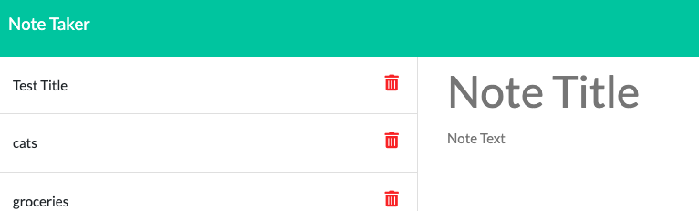

# note-taker

Description: This application uses express to route and save data on a front end application. Users can input a note title and note text, then the application creates an id and saves the notes in a menu on the left. Clicking on an existing note title will display the contents of that note. The front end design was built with starter code, and I added the espress routing to get the application to work. This project was an exercise to start learning express.

Installation: N/A

Usage: Please visit this link: https://afternoon-anchorage-07515.herokuapp.com/ 

Credits: N/A

License: Please refer to the license in the repo

